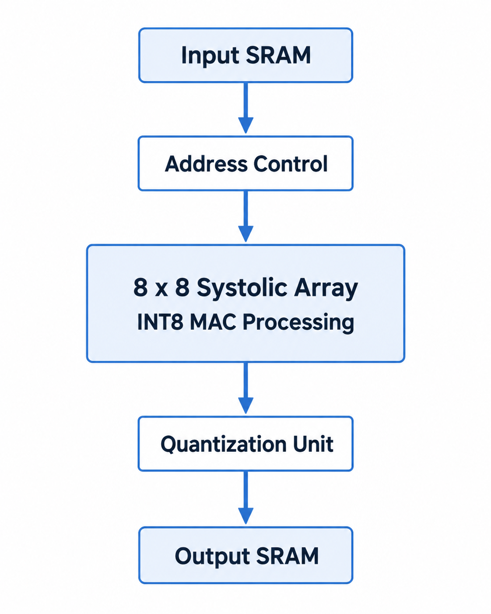
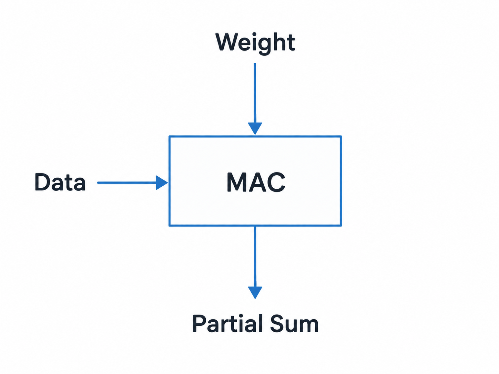
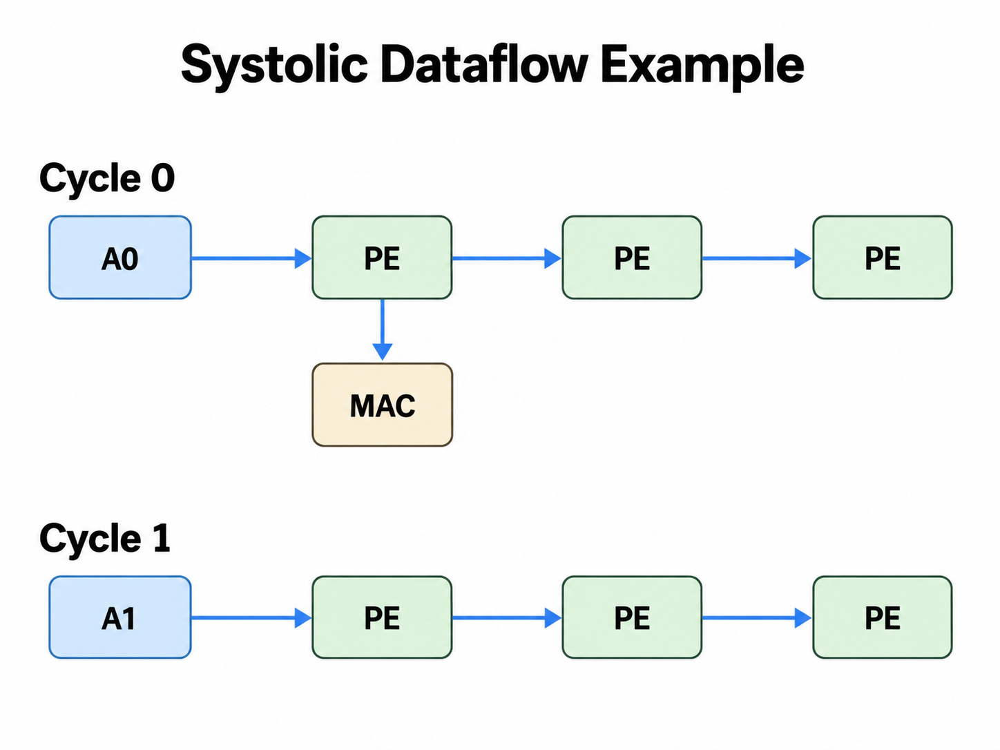

# TPU-Systolic-Array

<p align="center">
<b>A Parameterized TPU-style Systolic Array Accelerator in Verilog</b>
</p>

TPU-Systolic-Array is a hardware accelerator project implementing a **systolic-array based matrix multiplication engine** inspired by modern AI accelerators such as Google TPU.

The project demonstrates how neural-network workloads can be accelerated using:

- Spatial computing
- Parallel MAC operations
- Systolic data movement
- Quantized integer arithmetic
- SRAM-based data feeding
- RTL hardware design

---

## Architecture


The accelerator consists of:

<p align="center">

</p>

---

## Systolic Processing Element

Each processing element performs multiply-accumulate operations:

<p align="center">

</p>

Each PE:

- Receives input activation
- Receives weight value
- Performs multiplication
- Accumulates partial sums
- Passes data to neighboring PEs

---

## Features

- Parameterized systolic array size
- Default 8×8 processing array
- INT8 input data
- INT16 accumulation output
- Parallel MAC execution
- SRAM interface
- Hardware controller
- Quantization support
- RTL simulation testbench

---

## Repository Structure

```
TPU-Systolic-Array/

├── modules.v/
│   ├── tpu_top.v
│   ├── systolic.v
│   ├── systolic_control.v
│   ├── quantize.v
│   ├── addr_sel.v
│   └── write_out.v
│
├── modules_tb.v/
│   ├── test_tpu.v
│   ├── systolic.v
│   └── SRAM models
│
└── README.md
```

---

## Hardware Configuration

Default configuration:

```verilog
ARRAY_SIZE = 8
DATA_WIDTH = 8
OUTPUT_WIDTH = 16
```

Meaning:

```
Processing Elements = 8 × 8 = 64

Input Precision     = INT8

Accumulator          = INT16

Parallel MACs       = 64 / cycle
```

---

## Dataflow

The accelerator uses a systolic dataflow:

<p align="center">

</p>

Data continuously moves through the array while each PE computes locally.

Benefits:

- High data reuse
- Low memory traffic
- High throughput
- Regular hardware structure

---

## Simulation

The project includes a Verilog testbench:

```
modules_tb.v/test_tpu.v
```

The testbench:

- Generates clock/reset
- Loads SRAM models
- Starts TPU execution
- Checks output behavior
- Generates simulation waveforms

Example:

```bash
iverilog -o sim \
modules.v/*.v \
modules_tb.v/*.v

vvp sim
```

---

## Applications

This accelerator architecture can be extended for:

- CNN acceleration
- Transformer linear layers
- GEMM engines
- Vision Transformer inference
- Edge AI devices
- FPGA accelerators
- ASIC AI processors

---

## Future Improvements

Possible extensions:

- AXI4 interface
- Larger systolic arrays
- Pipeline optimization
- INT4/INT8 mixed precision
- Sparse computation
- SRAM banking
- FPGA synthesis
- ASIC physical design
- Power and area analysis

---

## Author

Matin Firoozbakht

Research interests:

- AI Accelerators
- Computer Vision
- Efficient Deep Learning
- Hardware Architecture
- FPGA/ASIC Design

---

## License

MIT License
